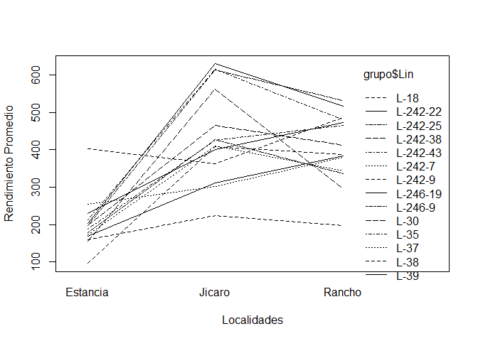

Análisis de Rendimiento de Líneas de Frijol Tepary en Múltiples
Localidades
================
Dr. Byron González

- [Introducción](#introducción)
- [1. Preparación del Entorno](#1-preparación-del-entorno)
- [2. Análisis Exploratorio de Datos
  (EDA)](#2-análisis-exploratorio-de-datos-eda)
- [3. Análisis de Varianza (ANOVA)](#3-análisis-de-varianza-anova)
- [4. Análisis con Modelos Mixtos](#4-análisis-con-modelos-mixtos)
- [5. Comparación de Medias
  (Post-Hoc)](#5-comparación-de-medias-post-hoc)

## Introducción

Este documento presenta el análisis de un experimento en bloques
completos al azar para evaluar el rendimiento (`Rend`) de 14 líneas
(`Lin`) de frijol Tepary en 3 localidades (`Loc`) diferentes. En cada
localidad, el experimento se replicó en 4 bloques (`Bloq`).

El objetivo es determinar si existen diferencias significativas en el
rendimiento entre las líneas, entre las localidades, y si existe una
interacción entre ambos factores.

## 1. Preparación del Entorno

### Carga de Bibliotecas

Primero, se colocan en memoria todas las bibliotecas necesarias para el
análisis. El siguiente código verifica si cada librería está instalada;
de no ser así, la instalará y luego la cargará.

``` r
# Lista de paquetes requeridos
packages <- c("car", "lattice", "tidyverse", "performance", "nlme", 
              "lme4", "lmerTest", "emmeans", "multcomp", "readxl")

# Instalar y cargar paquetes
for (pkg in packages) {
  if (!require(pkg, character.only = TRUE)) {
    install.packages(pkg)
    library(pkg, character.only = TRUE)
  }
}
```

### Importación y Preparación de Datos

Se importan los datos desde el archivo `frijol.xlsx`. Luego, se
convierten las variables categóricas (`Loc`, `Lin`, `Bloq`, `Loc_Bloq`)
a factores, que es el tipo de dato adecuado para variables de agrupación
en los modelos estadísticos de R.

``` r
# Importar la tabla de datos "frijol.xlsx"
grupo <- read_excel("frijol.xlsx")

# Vistazo inicial a los datos
head(grupo)
```

    ## # A tibble: 6 × 5
    ##   Loc    Lin       Bloq  Rend Loc_Bloq
    ##   <chr>  <chr>    <dbl> <dbl> <chr>   
    ## 1 Jicaro L-18         1  406. Jicaro_1
    ## 2 Jicaro L-242-43     1  755. Jicaro_1
    ## 3 Jicaro L-242-7      1  349. Jicaro_1
    ## 4 Jicaro L-39         1  232. Jicaro_1
    ## 5 Jicaro L-246-19     1  400. Jicaro_1
    ## 6 Jicaro L-242-22     1  373. Jicaro_1

``` r
tail(grupo)
```

    ## # A tibble: 6 × 5
    ##   Loc      Lin       Bloq  Rend Loc_Bloq  
    ##   <chr>    <chr>    <dbl> <dbl> <chr>     
    ## 1 Estancia L-242-25     4  178. Estancia_4
    ## 2 Estancia L-242-38     4  141. Estancia_4
    ## 3 Estancia L-38         4  156. Estancia_4
    ## 4 Estancia L-30         4  168. Estancia_4
    ## 5 Estancia L-35         4  235. Estancia_4
    ## 6 Estancia L-37         4  230. Estancia_4

``` r
# Conversión de variables a factores
grupo$Loc <- as.factor(grupo$Loc)
grupo$Lin <- as.factor(grupo$Lin)
grupo$Bloq <- as.factor(grupo$Bloq)
grupo$Loc_Bloq <- as.factor(grupo$Loc_Bloq)

# Revisar la estructura final de los datos
str(grupo)
```

    ## tibble [168 × 5] (S3: tbl_df/tbl/data.frame)
    ##  $ Loc     : Factor w/ 3 levels "Estancia","Jicaro",..: 2 2 2 2 2 2 2 2 2 2 ...
    ##  $ Lin     : Factor w/ 14 levels "L-18","L-242-22",..: 1 5 6 14 8 2 7 9 3 4 ...
    ##  $ Bloq    : Factor w/ 4 levels "1","2","3","4": 1 1 1 1 1 1 1 1 1 1 ...
    ##  $ Rend    : num [1:168] 406 755 349 232 400 ...
    ##  $ Loc_Bloq: Factor w/ 12 levels "Estancia_1","Estancia_2",..: 5 5 5 5 5 5 5 5 5 5 ...

## 2. Análisis Exploratorio de Datos (EDA)

### Gráfico de Interacción

Un gráfico de interacción permite visualizar cómo el rendimiento
promedio de las líneas cambia a través de las diferentes localidades. Si
las líneas no son paralelas, sugiere una posible interacción
`Localidad:Línea`, lo que significaría que la “mejor” línea depende de
la localidad.

<figure>

<figcaption aria-hidden="true">Gráfico de interacción entre Localidad y
Línea.</figcaption>
</figure>

### Verificación del Diseño Experimental

Se comprueba que el diseño experimental esté balanceado. Es decir, que
todas las líneas se hayan probado en todas las localidades y que el
número de bloques sea consistente.

``` r
# Verificar que todas las localidades tienen todas las líneas
knitr::kable(with(grupo, table(Loc, Lin)), caption = "Tabla de contingencia: Localidad vs. Línea")
```

|  | L-18 | L-242-22 | L-242-25 | L-242-38 | L-242-43 | L-242-7 | L-242-9 | L-246-19 | L-246-9 | L-30 | L-35 | L-37 | L-38 | L-39 |
|:---|---:|---:|---:|---:|---:|---:|---:|---:|---:|---:|---:|---:|---:|---:|
| Estancia | 4 | 4 | 4 | 4 | 4 | 4 | 4 | 4 | 4 | 4 | 4 | 4 | 4 | 4 |
| Jicaro | 4 | 4 | 4 | 4 | 4 | 4 | 4 | 4 | 4 | 4 | 4 | 4 | 4 | 4 |
| Rancho | 4 | 4 | 4 | 4 | 4 | 4 | 4 | 4 | 4 | 4 | 4 | 4 | 4 | 4 |

Tabla de contingencia: Localidad vs. Línea

``` r
# Verificar el número de bloques por localidad
knitr::kable(with(grupo, table(Loc, Bloq)), caption = "Tabla de contingencia: Localidad vs. Bloque")
```

|          |   1 |   2 |   3 |   4 |
|:---------|----:|----:|----:|----:|
| Estancia |  14 |  14 |  14 |  14 |
| Jicaro   |  14 |  14 |  14 |  14 |
| Rancho   |  14 |  14 |  14 |  14 |

Tabla de contingencia: Localidad vs. Bloque

### Visualización del Rendimiento por Factor

Usando `lattice`, se crean gráficos para observar la distribución del
rendimiento de cada línea dentro de cada localidad y viceversa. Esto nos
da una idea más detallada de la variabilidad de los datos.


## 3. Análisis de Varianza (ANOVA)

### ANOVA por Localidad (Ejemplo)

Como primer enfoque, se realiz un análisis de varianza (ANOVA) para una
sola localidad. El modelo estadístico para un diseño en bloques
completos al azar es:

$$y_{ij} = \mu + Bloq_i + Lin_j + \epsilon_{ij}$$

Donde: \* $y_{ij}$ es el rendimiento. \* $\mu$ es la media general. \*
$Bloq_i$ es el efecto del i-ésimo bloque. \* $Lin_j$ es el efecto de la
j-ésima línea. \* $\epsilon_{ij}$ es el error experimental.

Aquí, `Bloq` y `Lin` se tratan como efectos fijos.

``` r
# Subconjunto de datos para la localidad "Jicaro"
jic <- subset(grupo, Loc == "Jicaro")

# Ajuste del modelo lineal (ANOVA)
aov.jic <- lm(Rend ~ Bloq + Lin, data = jic)

# Tabla ANOVA
anova(aov.jic)
```

    ## Analysis of Variance Table
    ## 
    ## Response: Rend
    ##           Df Sum Sq Mean Sq F value    Pr(>F)    
    ## Bloq       3  13704    4568  0.3540    0.7865    
    ## Lin       13 817803   62908  4.8746 5.693e-05 ***
    ## Residuals 39 503306   12905                      
    ## ---
    ## Signif. codes:  0 '***' 0.001 '**' 0.01 '*' 0.05 '.' 0.1 ' ' 1

### ANOVA para todas las localidades (Iterativamente)

Es posible automatizar el proceso anterior para todas las localidades
usando `split` y `lapply`. Esto nos permite ajustar un modelo ANOVA para
cada localidad y extraer los resultados de forma eficiente.

``` r
# 1. Dividir el dataframe en una lista, con un elemento por localidad
das <- split(grupo, grupo$Loc)

# 2. Ajustar un modelo ANOVA para cada elemento de la lista
m01 <- lapply(das, FUN = aov, formula = Rend ~ Bloq + Lin)

# 3. Mostrar la tabla ANOVA para cada localidad
lapply(m01, anova)
```

    ## $Estancia
    ## Analysis of Variance Table
    ## 
    ## Response: Rend
    ##           Df Sum Sq Mean Sq F value   Pr(>F)    
    ## Bloq       3  11782  3927.2  2.0284   0.1257    
    ## Lin       13 247205 19015.8  9.8219 1.25e-08 ***
    ## Residuals 39  75506  1936.1                     
    ## ---
    ## Signif. codes:  0 '***' 0.001 '**' 0.01 '*' 0.05 '.' 0.1 ' ' 1
    ## 
    ## $Jicaro
    ## Analysis of Variance Table
    ## 
    ## Response: Rend
    ##           Df Sum Sq Mean Sq F value    Pr(>F)    
    ## Bloq       3  13704    4568  0.3540    0.7865    
    ## Lin       13 817803   62908  4.8746 5.693e-05 ***
    ## Residuals 39 503306   12905                      
    ## ---
    ## Signif. codes:  0 '***' 0.001 '**' 0.01 '*' 0.05 '.' 0.1 ' ' 1
    ## 
    ## $Rancho
    ## Analysis of Variance Table
    ## 
    ## Response: Rend
    ##           Df  Sum Sq Mean Sq F value Pr(>F)
    ## Bloq       3   23844    7948  0.2141 0.8861
    ## Lin       13  456347   35104  0.9454 0.5184
    ## Residuals 39 1448098   37131

``` r
# 4. Extraer los cuadrados medios del error (residual) de cada modelo
glrs <- sapply(m01, df.residual)   # Grados de libertad del residual
qmrs <- sapply(m01, deviance) / glrs # Cuadrados medios del residual

print("Cuadrados Medios del Error por Localidad:")
```

    ## [1] "Cuadrados Medios del Error por Localidad:"

``` r
print(qmrs)
```

    ##  Estancia    Jicaro    Rancho 
    ##  1936.063 12905.276 37130.725

La diferencia en los Cuadrados Medios del Error (`qmrs`) entre
localidades sugiere heterocedasticidad (varianzas desiguales). Esto
viola uno de los supuestos del ANOVA combinado. Esto justifica el uso de
modelos mixtos que puedan modelar esta variabilidad.

## 4. Análisis con Modelos Mixtos

Los modelos mixtos son ideales para este diseño experimental, debido a
que permiten: 1. Analizar todas las localidades juntas. 2. Modelar la
estructura de anidamiento de los bloques dentro de las localidades
(`Bloq` anidado en `Loc`) como un efecto aleatorio. 3. Modelar la
heterogeneidad de varianzas entre localidades.

### Modelo Mixto 1: Varianza Homogénea

Se ajusta un primer modelo mixto donde `Loc`, `Lin` y su interacción son
efectos fijos. El efecto `Loc_Bloq` (la combinación única de bloque
dentro de cada localidad) se trata como un efecto aleatorio. Este modelo
aún asume que la varianza del error es la misma en todas las
localidades.

``` r
mc12 <- lme(Rend ~ 1 + Loc + Lin + Loc:Lin,
            random = list(Loc_Bloq = pdIdent(~1)),
            method = "REML",
            data = grupo)

summary(mc12)
```

    ## Linear mixed-effects model fit by REML
    ##   Data: grupo 
    ##       AIC      BIC   logLik
    ##   1727.23 1852.026 -819.615
    ## 
    ## Random effects:
    ##  Formula: ~1 | Loc_Bloq
    ##         (Intercept) Residual
    ## StdDev: 0.006420683  128.367
    ## 
    ## Fixed effects:  Rend ~ 1 + Loc + Lin + Loc:Lin 
    ##                           Value Std.Error  DF   t-value p-value
    ## (Intercept)             96.2775  64.18351 117  1.500035  0.1363
    ## LocJicaro              312.6775  90.76919   9  3.444754  0.0073
    ## LocRancho              290.3275  90.76919   9  3.198525  0.0109
    ## LinL-242-22            106.1175  90.76919 117  1.169092  0.2447
    ## LinL-242-25            101.4475  90.76919 117  1.117643  0.2660
    ## LinL-242-38             58.6675  90.76919 117  0.646337  0.5193
    ## LinL-242-43            117.2325  90.76919 117  1.291545  0.1991
    ## LinL-242-7              76.1750  90.76919 117  0.839217  0.4031
    ## LinL-242-9             305.9700  90.76919 117  3.370858  0.0010
    ## LinL-246-19            134.2725  90.76919 117  1.479274  0.1418
    ## LinL-246-9              82.4350  90.76919 117  0.908183  0.3656
    ## LinL-30                101.3675  90.76919 117  1.116761  0.2664
    ## LinL-35                 91.0150  90.76919 117  1.002708  0.3181
    ## LinL-37                159.0650  90.76919 117  1.752412  0.0823
    ## LinL-38                 63.2725  90.76919 117  0.697070  0.4871
    ## LinL-39                 73.2625  90.76919 117  0.807130  0.4212
    ## LocJicaro:LinL-242-22  114.3675 128.36701 117  0.890942  0.3748
    ## LocRancho:LinL-242-22   24.4100 128.36701 117  0.190158  0.8495
    ## LocJicaro:LinL-242-25  102.5025 128.36701 117  0.798511  0.4262
    ## LocRancho:LinL-242-25   43.3675 128.36701 117  0.337840  0.7361
    ## LocJicaro:LinL-242-38   95.0100 128.36701 117  0.740143  0.4607
    ## LocRancho:LinL-242-38 -148.5250 128.36701 117 -1.157034  0.2496
    ## LocJicaro:LinL-242-43   88.8825 128.36701 117  0.692409  0.4901
    ## LocRancho:LinL-242-43  -22.9750 128.36701 117 -0.178979  0.8583
    ## LocJicaro:LinL-242-7   -74.8075 128.36701 117 -0.582763  0.5612
    ## LocRancho:LinL-242-7  -119.7625 128.36701 117 -0.932969  0.3528
    ## LocJicaro:LinL-242-9  -351.6300 128.36701 117 -2.739255  0.0071
    ## LocRancho:LinL-242-9  -206.0550 128.36701 117 -1.605202  0.1111
    ## LocJicaro:LinL-246-19 -143.1750 128.36701 117 -1.115357  0.2670
    ## LocRancho:LinL-246-19  -48.5450 128.36701 117 -0.378173  0.7060
    ## LocJicaro:LinL-246-9   -64.6025 128.36701 117 -0.503264  0.6157
    ## LocRancho:LinL-246-9  -133.7850 128.36701 117 -1.042207  0.2995
    ## LocJicaro:LinL-30      -45.1475 128.36701 117 -0.351706  0.7257
    ## LocRancho:LinL-30      -76.1125 128.36701 117 -0.592929  0.5544
    ## LocJicaro:LinL-35      -75.0975 128.36701 117 -0.585022  0.5597
    ## LocRancho:LinL-35      -12.8225 128.36701 117 -0.099889  0.9206
    ## LocJicaro:LinL-37     -266.4825 128.36701 117 -2.075942  0.0401
    ## LocRancho:LinL-37     -166.8525 128.36701 117 -1.299808  0.1962
    ## LocJicaro:LinL-38     -248.8275 128.36701 117 -1.938407  0.0550
    ## LocRancho:LinL-38     -252.3450 128.36701 117 -1.965809  0.0517
    ## LocJicaro:LinL-39     -170.7925 128.36701 117 -1.330501  0.1859
    ## LocRancho:LinL-39      -77.2225 128.36701 117 -0.601576  0.5486
    ##  Correlation: 
    ##                       (Intr) LocJcr LcRnch LL-242-22 LL-242-25 LL-242-3
    ## LocJicaro             -0.707                                           
    ## LocRancho             -0.707  0.500                                    
    ## LinL-242-22           -0.707  0.500  0.500                             
    ## LinL-242-25           -0.707  0.500  0.500  0.500                      
    ## LinL-242-38           -0.707  0.500  0.500  0.500     0.500            
    ## LinL-242-43           -0.707  0.500  0.500  0.500     0.500     0.500  
    ## LinL-242-7            -0.707  0.500  0.500  0.500     0.500     0.500  
    ## LinL-242-9            -0.707  0.500  0.500  0.500     0.500     0.500  
    ## LinL-246-19           -0.707  0.500  0.500  0.500     0.500     0.500  
    ## LinL-246-9            -0.707  0.500  0.500  0.500     0.500     0.500  
    ## LinL-30               -0.707  0.500  0.500  0.500     0.500     0.500  
    ## LinL-35               -0.707  0.500  0.500  0.500     0.500     0.500  
    ## LinL-37               -0.707  0.500  0.500  0.500     0.500     0.500  
    ## LinL-38               -0.707  0.500  0.500  0.500     0.500     0.500  
    ## LinL-39               -0.707  0.500  0.500  0.500     0.500     0.500  
    ## LocJicaro:LinL-242-22  0.500 -0.707 -0.354 -0.707    -0.354    -0.354  
    ## LocRancho:LinL-242-22  0.500 -0.354 -0.707 -0.707    -0.354    -0.354  
    ## LocJicaro:LinL-242-25  0.500 -0.707 -0.354 -0.354    -0.707    -0.354  
    ## LocRancho:LinL-242-25  0.500 -0.354 -0.707 -0.354    -0.707    -0.354  
    ## LocJicaro:LinL-242-38  0.500 -0.707 -0.354 -0.354    -0.354    -0.707  
    ## LocRancho:LinL-242-38  0.500 -0.354 -0.707 -0.354    -0.354    -0.707  
    ## LocJicaro:LinL-242-43  0.500 -0.707 -0.354 -0.354    -0.354    -0.354  
    ## LocRancho:LinL-242-43  0.500 -0.354 -0.707 -0.354    -0.354    -0.354  
    ## LocJicaro:LinL-242-7   0.500 -0.707 -0.354 -0.354    -0.354    -0.354  
    ## LocRancho:LinL-242-7   0.500 -0.354 -0.707 -0.354    -0.354    -0.354  
    ## LocJicaro:LinL-242-9   0.500 -0.707 -0.354 -0.354    -0.354    -0.354  
    ## LocRancho:LinL-242-9   0.500 -0.354 -0.707 -0.354    -0.354    -0.354  
    ## LocJicaro:LinL-246-19  0.500 -0.707 -0.354 -0.354    -0.354    -0.354  
    ## LocRancho:LinL-246-19  0.500 -0.354 -0.707 -0.354    -0.354    -0.354  
    ## LocJicaro:LinL-246-9   0.500 -0.707 -0.354 -0.354    -0.354    -0.354  
    ## LocRancho:LinL-246-9   0.500 -0.354 -0.707 -0.354    -0.354    -0.354  
    ## LocJicaro:LinL-30      0.500 -0.707 -0.354 -0.354    -0.354    -0.354  
    ## LocRancho:LinL-30      0.500 -0.354 -0.707 -0.354    -0.354    -0.354  
    ## LocJicaro:LinL-35      0.500 -0.707 -0.354 -0.354    -0.354    -0.354  
    ## LocRancho:LinL-35      0.500 -0.354 -0.707 -0.354    -0.354    -0.354  
    ## LocJicaro:LinL-37      0.500 -0.707 -0.354 -0.354    -0.354    -0.354  
    ## LocRancho:LinL-37      0.500 -0.354 -0.707 -0.354    -0.354    -0.354  
    ## LocJicaro:LinL-38      0.500 -0.707 -0.354 -0.354    -0.354    -0.354  
    ## LocRancho:LinL-38      0.500 -0.354 -0.707 -0.354    -0.354    -0.354  
    ## LocJicaro:LinL-39      0.500 -0.707 -0.354 -0.354    -0.354    -0.354  
    ## LocRancho:LinL-39      0.500 -0.354 -0.707 -0.354    -0.354    -0.354  
    ##                       LL-242-4 LL-242-7 LL-242-9 LL-246-1 LL-246-9 LnL-30
    ## LocJicaro                                                                
    ## LocRancho                                                                
    ## LinL-242-22                                                              
    ## LinL-242-25                                                              
    ## LinL-242-38                                                              
    ## LinL-242-43                                                              
    ## LinL-242-7             0.500                                             
    ## LinL-242-9             0.500    0.500                                    
    ## LinL-246-19            0.500    0.500    0.500                           
    ## LinL-246-9             0.500    0.500    0.500    0.500                  
    ## LinL-30                0.500    0.500    0.500    0.500    0.500         
    ## LinL-35                0.500    0.500    0.500    0.500    0.500    0.500
    ## LinL-37                0.500    0.500    0.500    0.500    0.500    0.500
    ## LinL-38                0.500    0.500    0.500    0.500    0.500    0.500
    ## LinL-39                0.500    0.500    0.500    0.500    0.500    0.500
    ## LocJicaro:LinL-242-22 -0.354   -0.354   -0.354   -0.354   -0.354   -0.354
    ## LocRancho:LinL-242-22 -0.354   -0.354   -0.354   -0.354   -0.354   -0.354
    ## LocJicaro:LinL-242-25 -0.354   -0.354   -0.354   -0.354   -0.354   -0.354
    ## LocRancho:LinL-242-25 -0.354   -0.354   -0.354   -0.354   -0.354   -0.354
    ## LocJicaro:LinL-242-38 -0.354   -0.354   -0.354   -0.354   -0.354   -0.354
    ## LocRancho:LinL-242-38 -0.354   -0.354   -0.354   -0.354   -0.354   -0.354
    ## LocJicaro:LinL-242-43 -0.707   -0.354   -0.354   -0.354   -0.354   -0.354
    ## LocRancho:LinL-242-43 -0.707   -0.354   -0.354   -0.354   -0.354   -0.354
    ## LocJicaro:LinL-242-7  -0.354   -0.707   -0.354   -0.354   -0.354   -0.354
    ## LocRancho:LinL-242-7  -0.354   -0.707   -0.354   -0.354   -0.354   -0.354
    ## LocJicaro:LinL-242-9  -0.354   -0.354   -0.707   -0.354   -0.354   -0.354
    ## LocRancho:LinL-242-9  -0.354   -0.354   -0.707   -0.354   -0.354   -0.354
    ## LocJicaro:LinL-246-19 -0.354   -0.354   -0.354   -0.707   -0.354   -0.354
    ## LocRancho:LinL-246-19 -0.354   -0.354   -0.354   -0.707   -0.354   -0.354
    ## LocJicaro:LinL-246-9  -0.354   -0.354   -0.354   -0.354   -0.707   -0.354
    ## LocRancho:LinL-246-9  -0.354   -0.354   -0.354   -0.354   -0.707   -0.354
    ## LocJicaro:LinL-30     -0.354   -0.354   -0.354   -0.354   -0.354   -0.707
    ## LocRancho:LinL-30     -0.354   -0.354   -0.354   -0.354   -0.354   -0.707
    ## LocJicaro:LinL-35     -0.354   -0.354   -0.354   -0.354   -0.354   -0.354
    ## LocRancho:LinL-35     -0.354   -0.354   -0.354   -0.354   -0.354   -0.354
    ## LocJicaro:LinL-37     -0.354   -0.354   -0.354   -0.354   -0.354   -0.354
    ## LocRancho:LinL-37     -0.354   -0.354   -0.354   -0.354   -0.354   -0.354
    ## LocJicaro:LinL-38     -0.354   -0.354   -0.354   -0.354   -0.354   -0.354
    ## LocRancho:LinL-38     -0.354   -0.354   -0.354   -0.354   -0.354   -0.354
    ## LocJicaro:LinL-39     -0.354   -0.354   -0.354   -0.354   -0.354   -0.354
    ## LocRancho:LinL-39     -0.354   -0.354   -0.354   -0.354   -0.354   -0.354
    ##                       LnL-35 LnL-37 LnL-38 LnL-39 LJ:LL-242-22 LR:LL-242-22
    ## LocJicaro                                                                  
    ## LocRancho                                                                  
    ## LinL-242-22                                                                
    ## LinL-242-25                                                                
    ## LinL-242-38                                                                
    ## LinL-242-43                                                                
    ## LinL-242-7                                                                 
    ## LinL-242-9                                                                 
    ## LinL-246-19                                                                
    ## LinL-246-9                                                                 
    ## LinL-30                                                                    
    ## LinL-35                                                                    
    ## LinL-37                0.500                                               
    ## LinL-38                0.500  0.500                                        
    ## LinL-39                0.500  0.500  0.500                                 
    ## LocJicaro:LinL-242-22 -0.354 -0.354 -0.354 -0.354                          
    ## LocRancho:LinL-242-22 -0.354 -0.354 -0.354 -0.354  0.500                   
    ## LocJicaro:LinL-242-25 -0.354 -0.354 -0.354 -0.354  0.500        0.250      
    ## LocRancho:LinL-242-25 -0.354 -0.354 -0.354 -0.354  0.250        0.500      
    ## LocJicaro:LinL-242-38 -0.354 -0.354 -0.354 -0.354  0.500        0.250      
    ## LocRancho:LinL-242-38 -0.354 -0.354 -0.354 -0.354  0.250        0.500      
    ## LocJicaro:LinL-242-43 -0.354 -0.354 -0.354 -0.354  0.500        0.250      
    ## LocRancho:LinL-242-43 -0.354 -0.354 -0.354 -0.354  0.250        0.500      
    ## LocJicaro:LinL-242-7  -0.354 -0.354 -0.354 -0.354  0.500        0.250      
    ## LocRancho:LinL-242-7  -0.354 -0.354 -0.354 -0.354  0.250        0.500      
    ## LocJicaro:LinL-242-9  -0.354 -0.354 -0.354 -0.354  0.500        0.250      
    ## LocRancho:LinL-242-9  -0.354 -0.354 -0.354 -0.354  0.250        0.500      
    ## LocJicaro:LinL-246-19 -0.354 -0.354 -0.354 -0.354  0.500        0.250      
    ## LocRancho:LinL-246-19 -0.354 -0.354 -0.354 -0.354  0.250        0.500      
    ## LocJicaro:LinL-246-9  -0.354 -0.354 -0.354 -0.354  0.500        0.250      
    ## LocRancho:LinL-246-9  -0.354 -0.354 -0.354 -0.354  0.250        0.500      
    ## LocJicaro:LinL-30     -0.354 -0.354 -0.354 -0.354  0.500        0.250      
    ## LocRancho:LinL-30     -0.354 -0.354 -0.354 -0.354  0.250        0.500      
    ## LocJicaro:LinL-35     -0.707 -0.354 -0.354 -0.354  0.500        0.250      
    ## LocRancho:LinL-35     -0.707 -0.354 -0.354 -0.354  0.250        0.500      
    ## LocJicaro:LinL-37     -0.354 -0.707 -0.354 -0.354  0.500        0.250      
    ## LocRancho:LinL-37     -0.354 -0.707 -0.354 -0.354  0.250        0.500      
    ## LocJicaro:LinL-38     -0.354 -0.354 -0.707 -0.354  0.500        0.250      
    ## LocRancho:LinL-38     -0.354 -0.354 -0.707 -0.354  0.250        0.500      
    ## LocJicaro:LinL-39     -0.354 -0.354 -0.354 -0.707  0.500        0.250      
    ## LocRancho:LinL-39     -0.354 -0.354 -0.354 -0.707  0.250        0.500      
    ##                       LJ:LL-242-25 LR:LL-242-25 LJ:LL-242-3 LR:LL-242-3
    ## LocJicaro                                                              
    ## LocRancho                                                              
    ## LinL-242-22                                                            
    ## LinL-242-25                                                            
    ## LinL-242-38                                                            
    ## LinL-242-43                                                            
    ## LinL-242-7                                                             
    ## LinL-242-9                                                             
    ## LinL-246-19                                                            
    ## LinL-246-9                                                             
    ## LinL-30                                                                
    ## LinL-35                                                                
    ## LinL-37                                                                
    ## LinL-38                                                                
    ## LinL-39                                                                
    ## LocJicaro:LinL-242-22                                                  
    ## LocRancho:LinL-242-22                                                  
    ## LocJicaro:LinL-242-25                                                  
    ## LocRancho:LinL-242-25  0.500                                           
    ## LocJicaro:LinL-242-38  0.500        0.250                              
    ## LocRancho:LinL-242-38  0.250        0.500        0.500                 
    ## LocJicaro:LinL-242-43  0.500        0.250        0.500       0.250     
    ## LocRancho:LinL-242-43  0.250        0.500        0.250       0.500     
    ## LocJicaro:LinL-242-7   0.500        0.250        0.500       0.250     
    ## LocRancho:LinL-242-7   0.250        0.500        0.250       0.500     
    ## LocJicaro:LinL-242-9   0.500        0.250        0.500       0.250     
    ## LocRancho:LinL-242-9   0.250        0.500        0.250       0.500     
    ## LocJicaro:LinL-246-19  0.500        0.250        0.500       0.250     
    ## LocRancho:LinL-246-19  0.250        0.500        0.250       0.500     
    ## LocJicaro:LinL-246-9   0.500        0.250        0.500       0.250     
    ## LocRancho:LinL-246-9   0.250        0.500        0.250       0.500     
    ## LocJicaro:LinL-30      0.500        0.250        0.500       0.250     
    ## LocRancho:LinL-30      0.250        0.500        0.250       0.500     
    ## LocJicaro:LinL-35      0.500        0.250        0.500       0.250     
    ## LocRancho:LinL-35      0.250        0.500        0.250       0.500     
    ## LocJicaro:LinL-37      0.500        0.250        0.500       0.250     
    ## LocRancho:LinL-37      0.250        0.500        0.250       0.500     
    ## LocJicaro:LinL-38      0.500        0.250        0.500       0.250     
    ## LocRancho:LinL-38      0.250        0.500        0.250       0.500     
    ## LocJicaro:LinL-39      0.500        0.250        0.500       0.250     
    ## LocRancho:LinL-39      0.250        0.500        0.250       0.500     
    ##                       LJ:LL-242-4 LR:LL-242-4 LJ:LL-242-7 LR:LL-242-7
    ## LocJicaro                                                            
    ## LocRancho                                                            
    ## LinL-242-22                                                          
    ## LinL-242-25                                                          
    ## LinL-242-38                                                          
    ## LinL-242-43                                                          
    ## LinL-242-7                                                           
    ## LinL-242-9                                                           
    ## LinL-246-19                                                          
    ## LinL-246-9                                                           
    ## LinL-30                                                              
    ## LinL-35                                                              
    ## LinL-37                                                              
    ## LinL-38                                                              
    ## LinL-39                                                              
    ## LocJicaro:LinL-242-22                                                
    ## LocRancho:LinL-242-22                                                
    ## LocJicaro:LinL-242-25                                                
    ## LocRancho:LinL-242-25                                                
    ## LocJicaro:LinL-242-38                                                
    ## LocRancho:LinL-242-38                                                
    ## LocJicaro:LinL-242-43                                                
    ## LocRancho:LinL-242-43  0.500                                         
    ## LocJicaro:LinL-242-7   0.500       0.250                             
    ## LocRancho:LinL-242-7   0.250       0.500       0.500                 
    ## LocJicaro:LinL-242-9   0.500       0.250       0.500       0.250     
    ## LocRancho:LinL-242-9   0.250       0.500       0.250       0.500     
    ## LocJicaro:LinL-246-19  0.500       0.250       0.500       0.250     
    ## LocRancho:LinL-246-19  0.250       0.500       0.250       0.500     
    ## LocJicaro:LinL-246-9   0.500       0.250       0.500       0.250     
    ## LocRancho:LinL-246-9   0.250       0.500       0.250       0.500     
    ## LocJicaro:LinL-30      0.500       0.250       0.500       0.250     
    ## LocRancho:LinL-30      0.250       0.500       0.250       0.500     
    ## LocJicaro:LinL-35      0.500       0.250       0.500       0.250     
    ## LocRancho:LinL-35      0.250       0.500       0.250       0.500     
    ## LocJicaro:LinL-37      0.500       0.250       0.500       0.250     
    ## LocRancho:LinL-37      0.250       0.500       0.250       0.500     
    ## LocJicaro:LinL-38      0.500       0.250       0.500       0.250     
    ## LocRancho:LinL-38      0.250       0.500       0.250       0.500     
    ## LocJicaro:LinL-39      0.500       0.250       0.500       0.250     
    ## LocRancho:LinL-39      0.250       0.500       0.250       0.500     
    ##                       LJ:LL-242-9 LR:LL-242-9 LJ:LL-246-1 LR:LL-246-1
    ## LocJicaro                                                            
    ## LocRancho                                                            
    ## LinL-242-22                                                          
    ## LinL-242-25                                                          
    ## LinL-242-38                                                          
    ## LinL-242-43                                                          
    ## LinL-242-7                                                           
    ## LinL-242-9                                                           
    ## LinL-246-19                                                          
    ## LinL-246-9                                                           
    ## LinL-30                                                              
    ## LinL-35                                                              
    ## LinL-37                                                              
    ## LinL-38                                                              
    ## LinL-39                                                              
    ## LocJicaro:LinL-242-22                                                
    ## LocRancho:LinL-242-22                                                
    ## LocJicaro:LinL-242-25                                                
    ## LocRancho:LinL-242-25                                                
    ## LocJicaro:LinL-242-38                                                
    ## LocRancho:LinL-242-38                                                
    ## LocJicaro:LinL-242-43                                                
    ## LocRancho:LinL-242-43                                                
    ## LocJicaro:LinL-242-7                                                 
    ## LocRancho:LinL-242-7                                                 
    ## LocJicaro:LinL-242-9                                                 
    ## LocRancho:LinL-242-9   0.500                                         
    ## LocJicaro:LinL-246-19  0.500       0.250                             
    ## LocRancho:LinL-246-19  0.250       0.500       0.500                 
    ## LocJicaro:LinL-246-9   0.500       0.250       0.500       0.250     
    ## LocRancho:LinL-246-9   0.250       0.500       0.250       0.500     
    ## LocJicaro:LinL-30      0.500       0.250       0.500       0.250     
    ## LocRancho:LinL-30      0.250       0.500       0.250       0.500     
    ## LocJicaro:LinL-35      0.500       0.250       0.500       0.250     
    ## LocRancho:LinL-35      0.250       0.500       0.250       0.500     
    ## LocJicaro:LinL-37      0.500       0.250       0.500       0.250     
    ## LocRancho:LinL-37      0.250       0.500       0.250       0.500     
    ## LocJicaro:LinL-38      0.500       0.250       0.500       0.250     
    ## LocRancho:LinL-38      0.250       0.500       0.250       0.500     
    ## LocJicaro:LinL-39      0.500       0.250       0.500       0.250     
    ## LocRancho:LinL-39      0.250       0.500       0.250       0.500     
    ##                       LJ:LL-246-9 LR:LL-246-9 LJ:LL-30 LR:LL-30 LJ:LL-35
    ## LocJicaro                                                               
    ## LocRancho                                                               
    ## LinL-242-22                                                             
    ## LinL-242-25                                                             
    ## LinL-242-38                                                             
    ## LinL-242-43                                                             
    ## LinL-242-7                                                              
    ## LinL-242-9                                                              
    ## LinL-246-19                                                             
    ## LinL-246-9                                                              
    ## LinL-30                                                                 
    ## LinL-35                                                                 
    ## LinL-37                                                                 
    ## LinL-38                                                                 
    ## LinL-39                                                                 
    ## LocJicaro:LinL-242-22                                                   
    ## LocRancho:LinL-242-22                                                   
    ## LocJicaro:LinL-242-25                                                   
    ## LocRancho:LinL-242-25                                                   
    ## LocJicaro:LinL-242-38                                                   
    ## LocRancho:LinL-242-38                                                   
    ## LocJicaro:LinL-242-43                                                   
    ## LocRancho:LinL-242-43                                                   
    ## LocJicaro:LinL-242-7                                                    
    ## LocRancho:LinL-242-7                                                    
    ## LocJicaro:LinL-242-9                                                    
    ## LocRancho:LinL-242-9                                                    
    ## LocJicaro:LinL-246-19                                                   
    ## LocRancho:LinL-246-19                                                   
    ## LocJicaro:LinL-246-9                                                    
    ## LocRancho:LinL-246-9   0.500                                            
    ## LocJicaro:LinL-30      0.500       0.250                                
    ## LocRancho:LinL-30      0.250       0.500       0.500                    
    ## LocJicaro:LinL-35      0.500       0.250       0.500    0.250           
    ## LocRancho:LinL-35      0.250       0.500       0.250    0.500    0.500  
    ## LocJicaro:LinL-37      0.500       0.250       0.500    0.250    0.500  
    ## LocRancho:LinL-37      0.250       0.500       0.250    0.500    0.250  
    ## LocJicaro:LinL-38      0.500       0.250       0.500    0.250    0.500  
    ## LocRancho:LinL-38      0.250       0.500       0.250    0.500    0.250  
    ## LocJicaro:LinL-39      0.500       0.250       0.500    0.250    0.500  
    ## LocRancho:LinL-39      0.250       0.500       0.250    0.500    0.250  
    ##                       LR:LL-35 LJ:LL-37 LR:LL-37 LJ:LL-38 LR:LL-38 LJ:LL-39
    ## LocJicaro                                                                  
    ## LocRancho                                                                  
    ## LinL-242-22                                                                
    ## LinL-242-25                                                                
    ## LinL-242-38                                                                
    ## LinL-242-43                                                                
    ## LinL-242-7                                                                 
    ## LinL-242-9                                                                 
    ## LinL-246-19                                                                
    ## LinL-246-9                                                                 
    ## LinL-30                                                                    
    ## LinL-35                                                                    
    ## LinL-37                                                                    
    ## LinL-38                                                                    
    ## LinL-39                                                                    
    ## LocJicaro:LinL-242-22                                                      
    ## LocRancho:LinL-242-22                                                      
    ## LocJicaro:LinL-242-25                                                      
    ## LocRancho:LinL-242-25                                                      
    ## LocJicaro:LinL-242-38                                                      
    ## LocRancho:LinL-242-38                                                      
    ## LocJicaro:LinL-242-43                                                      
    ## LocRancho:LinL-242-43                                                      
    ## LocJicaro:LinL-242-7                                                       
    ## LocRancho:LinL-242-7                                                       
    ## LocJicaro:LinL-242-9                                                       
    ## LocRancho:LinL-242-9                                                       
    ## LocJicaro:LinL-246-19                                                      
    ## LocRancho:LinL-246-19                                                      
    ## LocJicaro:LinL-246-9                                                       
    ## LocRancho:LinL-246-9                                                       
    ## LocJicaro:LinL-30                                                          
    ## LocRancho:LinL-30                                                          
    ## LocJicaro:LinL-35                                                          
    ## LocRancho:LinL-35                                                          
    ## LocJicaro:LinL-37      0.250                                               
    ## LocRancho:LinL-37      0.500    0.500                                      
    ## LocJicaro:LinL-38      0.250    0.500    0.250                             
    ## LocRancho:LinL-38      0.500    0.250    0.500    0.500                    
    ## LocJicaro:LinL-39      0.250    0.500    0.250    0.500    0.250           
    ## LocRancho:LinL-39      0.500    0.250    0.500    0.250    0.500    0.500  
    ## 
    ## Standardized Within-Group Residuals:
    ##         Min          Q1         Med          Q3         Max 
    ## -2.82714764 -0.46262372 -0.02678842  0.42869755  3.66392804 
    ## 
    ## Number of Observations: 168
    ## Number of Groups: 12

``` r
print(anova(mc12))
```

    ##             numDF denDF   F-value p-value
    ## (Intercept)     1   117 1242.0757  <.0001
    ## Loc             2     9   56.5920  <.0001
    ## Lin            13   117    3.7890  <.0001
    ## Loc:Lin        26   117    1.6565  0.0367

La tabla ANOVA muestra que la interacción `Loc:Lin` es altamente
significativa (p \< .0001), confirmando lo que sugería el gráfico de
interacción: el comportamiento de las líneas no es el mismo en todas las
localidades.

#### Diagnóstico del Modelo `mc12`

Los gráficos de residuos muestran un patrón de “abanico”, indicando que
la varianza no es constante (heterocedasticidad). Esto confirma que
necesitamos un modelo más complejo.


    ## Rancho_4 Rancho_2 
    ##      100       76

### Modelo Mixto 2: Modelando la Heterocedasticidad

Para corregir el problema anterior, se ajusta un segundo modelo mixto
que permite que la varianza del error sea diferente para cada localidad.
Esto se logra con el argumento `weights = varIdent(form = ~1 | Loc)`.

``` r
mc13 <- lme(Rend ~ 1 + Loc + Lin + Loc:Lin,
            random = list(Loc_Bloq = pdIdent(~1)),
            weights = varIdent(form = ~1 | Loc), # Permite varianzas diferentes por Localidad
            method = "REML",
            data = grupo)

summary(mc13) # El summary ya muestra los parámetros de varianza
```

    ## Linear mixed-effects model fit by REML
    ##   Data: grupo 
    ##        AIC      BIC    logLik
    ##   1663.197 1793.666 -785.5986
    ## 
    ## Random effects:
    ##  Formula: ~1 | Loc_Bloq
    ##         (Intercept) Residual
    ## StdDev:    9.440723  44.2356
    ## 
    ## Variance function:
    ##  Structure: Different standard deviations per stratum
    ##  Formula: ~1 | Loc 
    ##  Parameter estimates:
    ## Estancia   Jicaro   Rancho 
    ## 1.000000 2.510562 4.234913 
    ## Fixed effects:  Rend ~ 1 + Loc + Lin + Loc:Lin 
    ##                           Value Std.Error  DF   t-value p-value
    ## (Intercept)             96.2775  22.61590 117  4.257071  0.0000
    ## LocJicaro              312.6775  60.14260   9  5.198936  0.0006
    ## LocRancho              290.3275  96.47414   9  3.009382  0.0147
    ## LinL-242-22            106.1175  31.27929 117  3.392580  0.0009
    ## LinL-242-25            101.4475  31.27929 117  3.243280  0.0015
    ## LinL-242-38             58.6675  31.27929 117  1.875602  0.0632
    ## LinL-242-43            117.2325  31.27929 117  3.747927  0.0003
    ## LinL-242-7              76.1750  31.27929 117  2.435317  0.0164
    ## LinL-242-9             305.9700  31.27929 117  9.781871  0.0000
    ## LinL-246-19            134.2725  31.27929 117  4.292696  0.0000
    ## LinL-246-9              82.4350  31.27929 117  2.635450  0.0095
    ## LinL-30                101.3675  31.27929 117  3.240722  0.0016
    ## LinL-35                 91.0150  31.27929 117  2.909752  0.0043
    ## LinL-37                159.0650  31.27929 117  5.085313  0.0000
    ## LinL-38                 63.2725  31.27929 117  2.022824  0.0454
    ## LinL-39                 73.2625  31.27929 117  2.342204  0.0209
    ## LocJicaro:LinL-242-22  114.3675  84.52891 117  1.352999  0.1787
    ## LocRancho:LinL-242-22   24.4100 136.10801 117  0.179343  0.8580
    ## LocJicaro:LinL-242-25  102.5025  84.52891 117  1.212632  0.2277
    ## LocRancho:LinL-242-25   43.3675 136.10801 117  0.318626  0.7506
    ## LocJicaro:LinL-242-38   95.0100  84.52891 117  1.123994  0.2633
    ## LocRancho:LinL-242-38 -148.5250 136.10801 117 -1.091229  0.2774
    ## LocJicaro:LinL-242-43   88.8825  84.52891 117  1.051504  0.2952
    ## LocRancho:LinL-242-43  -22.9750 136.10801 117 -0.168800  0.8662
    ## LocJicaro:LinL-242-7   -74.8075  84.52891 117 -0.884993  0.3780
    ## LocRancho:LinL-242-7  -119.7625 136.10801 117 -0.879908  0.3807
    ## LocJicaro:LinL-242-9  -351.6300  84.52891 117 -4.159879  0.0001
    ## LocRancho:LinL-242-9  -206.0550 136.10801 117 -1.513908  0.1327
    ## LocJicaro:LinL-246-19 -143.1750  84.52891 117 -1.693799  0.0930
    ## LocRancho:LinL-246-19  -48.5450 136.10801 117 -0.356665  0.7220
    ## LocJicaro:LinL-246-9   -64.6025  84.52891 117 -0.764265  0.4462
    ## LocRancho:LinL-246-9  -133.7850 136.10801 117 -0.982933  0.3277
    ## LocJicaro:LinL-30      -45.1475  84.52891 117 -0.534107  0.5943
    ## LocRancho:LinL-30      -76.1125 136.10801 117 -0.559207  0.5771
    ## LocJicaro:LinL-35      -75.0975  84.52891 117 -0.888424  0.3761
    ## LocRancho:LinL-35      -12.8225 136.10801 117 -0.094208  0.9251
    ## LocJicaro:LinL-37     -266.4825  84.52891 117 -3.152561  0.0021
    ## LocRancho:LinL-37     -166.8525 136.10801 117 -1.225883  0.2227
    ## LocJicaro:LinL-38     -248.8275  84.52891 117 -2.943697  0.0039
    ## LocRancho:LinL-38     -252.3450 136.10801 117 -1.854005  0.0663
    ## LocJicaro:LinL-39     -170.7925  84.52891 117 -2.020522  0.0456
    ## LocRancho:LinL-39      -77.2225 136.10801 117 -0.567362  0.5716
    ##  Correlation: 
    ##                       (Intr) LocJcr LcRnch LL-242-22 LL-242-25 LL-242-3
    ## LocJicaro             -0.376                                           
    ## LocRancho             -0.234  0.088                                    
    ## LinL-242-22           -0.692  0.260  0.162                             
    ## LinL-242-25           -0.692  0.260  0.162  0.500                      
    ## LinL-242-38           -0.692  0.260  0.162  0.500     0.500            
    ## LinL-242-43           -0.692  0.260  0.162  0.500     0.500     0.500  
    ## LinL-242-7            -0.692  0.260  0.162  0.500     0.500     0.500  
    ## LinL-242-9            -0.692  0.260  0.162  0.500     0.500     0.500  
    ## LinL-246-19           -0.692  0.260  0.162  0.500     0.500     0.500  
    ## LinL-246-9            -0.692  0.260  0.162  0.500     0.500     0.500  
    ## LinL-30               -0.692  0.260  0.162  0.500     0.500     0.500  
    ## LinL-35               -0.692  0.260  0.162  0.500     0.500     0.500  
    ## LinL-37               -0.692  0.260  0.162  0.500     0.500     0.500  
    ## LinL-38               -0.692  0.260  0.162  0.500     0.500     0.500  
    ## LinL-39               -0.692  0.260  0.162  0.500     0.500     0.500  
    ## LocJicaro:LinL-242-22  0.256 -0.703 -0.060 -0.370    -0.185    -0.185  
    ## LocRancho:LinL-242-22  0.159 -0.060 -0.705 -0.230    -0.115    -0.115  
    ## LocJicaro:LinL-242-25  0.256 -0.703 -0.060 -0.185    -0.370    -0.185  
    ## LocRancho:LinL-242-25  0.159 -0.060 -0.705 -0.115    -0.230    -0.115  
    ## LocJicaro:LinL-242-38  0.256 -0.703 -0.060 -0.185    -0.185    -0.370  
    ## LocRancho:LinL-242-38  0.159 -0.060 -0.705 -0.115    -0.115    -0.230  
    ## LocJicaro:LinL-242-43  0.256 -0.703 -0.060 -0.185    -0.185    -0.185  
    ## LocRancho:LinL-242-43  0.159 -0.060 -0.705 -0.115    -0.115    -0.115  
    ## LocJicaro:LinL-242-7   0.256 -0.703 -0.060 -0.185    -0.185    -0.185  
    ## LocRancho:LinL-242-7   0.159 -0.060 -0.705 -0.115    -0.115    -0.115  
    ## LocJicaro:LinL-242-9   0.256 -0.703 -0.060 -0.185    -0.185    -0.185  
    ## LocRancho:LinL-242-9   0.159 -0.060 -0.705 -0.115    -0.115    -0.115  
    ## LocJicaro:LinL-246-19  0.256 -0.703 -0.060 -0.185    -0.185    -0.185  
    ## LocRancho:LinL-246-19  0.159 -0.060 -0.705 -0.115    -0.115    -0.115  
    ## LocJicaro:LinL-246-9   0.256 -0.703 -0.060 -0.185    -0.185    -0.185  
    ## LocRancho:LinL-246-9   0.159 -0.060 -0.705 -0.115    -0.115    -0.115  
    ## LocJicaro:LinL-30      0.256 -0.703 -0.060 -0.185    -0.185    -0.185  
    ## LocRancho:LinL-30      0.159 -0.060 -0.705 -0.115    -0.115    -0.115  
    ## LocJicaro:LinL-35      0.256 -0.703 -0.060 -0.185    -0.185    -0.185  
    ## LocRancho:LinL-35      0.159 -0.060 -0.705 -0.115    -0.115    -0.115  
    ## LocJicaro:LinL-37      0.256 -0.703 -0.060 -0.185    -0.185    -0.185  
    ## LocRancho:LinL-37      0.159 -0.060 -0.705 -0.115    -0.115    -0.115  
    ## LocJicaro:LinL-38      0.256 -0.703 -0.060 -0.185    -0.185    -0.185  
    ## LocRancho:LinL-38      0.159 -0.060 -0.705 -0.115    -0.115    -0.115  
    ## LocJicaro:LinL-39      0.256 -0.703 -0.060 -0.185    -0.185    -0.185  
    ## LocRancho:LinL-39      0.159 -0.060 -0.705 -0.115    -0.115    -0.115  
    ##                       LL-242-4 LL-242-7 LL-242-9 LL-246-1 LL-246-9 LnL-30
    ## LocJicaro                                                                
    ## LocRancho                                                                
    ## LinL-242-22                                                              
    ## LinL-242-25                                                              
    ## LinL-242-38                                                              
    ## LinL-242-43                                                              
    ## LinL-242-7             0.500                                             
    ## LinL-242-9             0.500    0.500                                    
    ## LinL-246-19            0.500    0.500    0.500                           
    ## LinL-246-9             0.500    0.500    0.500    0.500                  
    ## LinL-30                0.500    0.500    0.500    0.500    0.500         
    ## LinL-35                0.500    0.500    0.500    0.500    0.500    0.500
    ## LinL-37                0.500    0.500    0.500    0.500    0.500    0.500
    ## LinL-38                0.500    0.500    0.500    0.500    0.500    0.500
    ## LinL-39                0.500    0.500    0.500    0.500    0.500    0.500
    ## LocJicaro:LinL-242-22 -0.185   -0.185   -0.185   -0.185   -0.185   -0.185
    ## LocRancho:LinL-242-22 -0.115   -0.115   -0.115   -0.115   -0.115   -0.115
    ## LocJicaro:LinL-242-25 -0.185   -0.185   -0.185   -0.185   -0.185   -0.185
    ## LocRancho:LinL-242-25 -0.115   -0.115   -0.115   -0.115   -0.115   -0.115
    ## LocJicaro:LinL-242-38 -0.185   -0.185   -0.185   -0.185   -0.185   -0.185
    ## LocRancho:LinL-242-38 -0.115   -0.115   -0.115   -0.115   -0.115   -0.115
    ## LocJicaro:LinL-242-43 -0.370   -0.185   -0.185   -0.185   -0.185   -0.185
    ## LocRancho:LinL-242-43 -0.230   -0.115   -0.115   -0.115   -0.115   -0.115
    ## LocJicaro:LinL-242-7  -0.185   -0.370   -0.185   -0.185   -0.185   -0.185
    ## LocRancho:LinL-242-7  -0.115   -0.230   -0.115   -0.115   -0.115   -0.115
    ## LocJicaro:LinL-242-9  -0.185   -0.185   -0.370   -0.185   -0.185   -0.185
    ## LocRancho:LinL-242-9  -0.115   -0.115   -0.230   -0.115   -0.115   -0.115
    ## LocJicaro:LinL-246-19 -0.185   -0.185   -0.185   -0.370   -0.185   -0.185
    ## LocRancho:LinL-246-19 -0.115   -0.115   -0.115   -0.230   -0.115   -0.115
    ## LocJicaro:LinL-246-9  -0.185   -0.185   -0.185   -0.185   -0.370   -0.185
    ## LocRancho:LinL-246-9  -0.115   -0.115   -0.115   -0.115   -0.230   -0.115
    ## LocJicaro:LinL-30     -0.185   -0.185   -0.185   -0.185   -0.185   -0.370
    ## LocRancho:LinL-30     -0.115   -0.115   -0.115   -0.115   -0.115   -0.230
    ## LocJicaro:LinL-35     -0.185   -0.185   -0.185   -0.185   -0.185   -0.185
    ## LocRancho:LinL-35     -0.115   -0.115   -0.115   -0.115   -0.115   -0.115
    ## LocJicaro:LinL-37     -0.185   -0.185   -0.185   -0.185   -0.185   -0.185
    ## LocRancho:LinL-37     -0.115   -0.115   -0.115   -0.115   -0.115   -0.115
    ## LocJicaro:LinL-38     -0.185   -0.185   -0.185   -0.185   -0.185   -0.185
    ## LocRancho:LinL-38     -0.115   -0.115   -0.115   -0.115   -0.115   -0.115
    ## LocJicaro:LinL-39     -0.185   -0.185   -0.185   -0.185   -0.185   -0.185
    ## LocRancho:LinL-39     -0.115   -0.115   -0.115   -0.115   -0.115   -0.115
    ##                       LnL-35 LnL-37 LnL-38 LnL-39 LJ:LL-242-22 LR:LL-242-22
    ## LocJicaro                                                                  
    ## LocRancho                                                                  
    ## LinL-242-22                                                                
    ## LinL-242-25                                                                
    ## LinL-242-38                                                                
    ## LinL-242-43                                                                
    ## LinL-242-7                                                                 
    ## LinL-242-9                                                                 
    ## LinL-246-19                                                                
    ## LinL-246-9                                                                 
    ## LinL-30                                                                    
    ## LinL-35                                                                    
    ## LinL-37                0.500                                               
    ## LinL-38                0.500  0.500                                        
    ## LinL-39                0.500  0.500  0.500                                 
    ## LocJicaro:LinL-242-22 -0.185 -0.185 -0.185 -0.185                          
    ## LocRancho:LinL-242-22 -0.115 -0.115 -0.115 -0.115  0.085                   
    ## LocJicaro:LinL-242-25 -0.185 -0.185 -0.185 -0.185  0.500        0.043      
    ## LocRancho:LinL-242-25 -0.115 -0.115 -0.115 -0.115  0.043        0.500      
    ## LocJicaro:LinL-242-38 -0.185 -0.185 -0.185 -0.185  0.500        0.043      
    ## LocRancho:LinL-242-38 -0.115 -0.115 -0.115 -0.115  0.043        0.500      
    ## LocJicaro:LinL-242-43 -0.185 -0.185 -0.185 -0.185  0.500        0.043      
    ## LocRancho:LinL-242-43 -0.115 -0.115 -0.115 -0.115  0.043        0.500      
    ## LocJicaro:LinL-242-7  -0.185 -0.185 -0.185 -0.185  0.500        0.043      
    ## LocRancho:LinL-242-7  -0.115 -0.115 -0.115 -0.115  0.043        0.500      
    ## LocJicaro:LinL-242-9  -0.185 -0.185 -0.185 -0.185  0.500        0.043      
    ## LocRancho:LinL-242-9  -0.115 -0.115 -0.115 -0.115  0.043        0.500      
    ## LocJicaro:LinL-246-19 -0.185 -0.185 -0.185 -0.185  0.500        0.043      
    ## LocRancho:LinL-246-19 -0.115 -0.115 -0.115 -0.115  0.043        0.500      
    ## LocJicaro:LinL-246-9  -0.185 -0.185 -0.185 -0.185  0.500        0.043      
    ## LocRancho:LinL-246-9  -0.115 -0.115 -0.115 -0.115  0.043        0.500      
    ## LocJicaro:LinL-30     -0.185 -0.185 -0.185 -0.185  0.500        0.043      
    ## LocRancho:LinL-30     -0.115 -0.115 -0.115 -0.115  0.043        0.500      
    ## LocJicaro:LinL-35     -0.370 -0.185 -0.185 -0.185  0.500        0.043      
    ## LocRancho:LinL-35     -0.230 -0.115 -0.115 -0.115  0.043        0.500      
    ## LocJicaro:LinL-37     -0.185 -0.370 -0.185 -0.185  0.500        0.043      
    ## LocRancho:LinL-37     -0.115 -0.230 -0.115 -0.115  0.043        0.500      
    ## LocJicaro:LinL-38     -0.185 -0.185 -0.370 -0.185  0.500        0.043      
    ## LocRancho:LinL-38     -0.115 -0.115 -0.230 -0.115  0.043        0.500      
    ## LocJicaro:LinL-39     -0.185 -0.185 -0.185 -0.370  0.500        0.043      
    ## LocRancho:LinL-39     -0.115 -0.115 -0.115 -0.230  0.043        0.500      
    ##                       LJ:LL-242-25 LR:LL-242-25 LJ:LL-242-3 LR:LL-242-3
    ## LocJicaro                                                              
    ## LocRancho                                                              
    ## LinL-242-22                                                            
    ## LinL-242-25                                                            
    ## LinL-242-38                                                            
    ## LinL-242-43                                                            
    ## LinL-242-7                                                             
    ## LinL-242-9                                                             
    ## LinL-246-19                                                            
    ## LinL-246-9                                                             
    ## LinL-30                                                                
    ## LinL-35                                                                
    ## LinL-37                                                                
    ## LinL-38                                                                
    ## LinL-39                                                                
    ## LocJicaro:LinL-242-22                                                  
    ## LocRancho:LinL-242-22                                                  
    ## LocJicaro:LinL-242-25                                                  
    ## LocRancho:LinL-242-25  0.085                                           
    ## LocJicaro:LinL-242-38  0.500        0.043                              
    ## LocRancho:LinL-242-38  0.043        0.500        0.085                 
    ## LocJicaro:LinL-242-43  0.500        0.043        0.500       0.043     
    ## LocRancho:LinL-242-43  0.043        0.500        0.043       0.500     
    ## LocJicaro:LinL-242-7   0.500        0.043        0.500       0.043     
    ## LocRancho:LinL-242-7   0.043        0.500        0.043       0.500     
    ## LocJicaro:LinL-242-9   0.500        0.043        0.500       0.043     
    ## LocRancho:LinL-242-9   0.043        0.500        0.043       0.500     
    ## LocJicaro:LinL-246-19  0.500        0.043        0.500       0.043     
    ## LocRancho:LinL-246-19  0.043        0.500        0.043       0.500     
    ## LocJicaro:LinL-246-9   0.500        0.043        0.500       0.043     
    ## LocRancho:LinL-246-9   0.043        0.500        0.043       0.500     
    ## LocJicaro:LinL-30      0.500        0.043        0.500       0.043     
    ## LocRancho:LinL-30      0.043        0.500        0.043       0.500     
    ## LocJicaro:LinL-35      0.500        0.043        0.500       0.043     
    ## LocRancho:LinL-35      0.043        0.500        0.043       0.500     
    ## LocJicaro:LinL-37      0.500        0.043        0.500       0.043     
    ## LocRancho:LinL-37      0.043        0.500        0.043       0.500     
    ## LocJicaro:LinL-38      0.500        0.043        0.500       0.043     
    ## LocRancho:LinL-38      0.043        0.500        0.043       0.500     
    ## LocJicaro:LinL-39      0.500        0.043        0.500       0.043     
    ## LocRancho:LinL-39      0.043        0.500        0.043       0.500     
    ##                       LJ:LL-242-4 LR:LL-242-4 LJ:LL-242-7 LR:LL-242-7
    ## LocJicaro                                                            
    ## LocRancho                                                            
    ## LinL-242-22                                                          
    ## LinL-242-25                                                          
    ## LinL-242-38                                                          
    ## LinL-242-43                                                          
    ## LinL-242-7                                                           
    ## LinL-242-9                                                           
    ## LinL-246-19                                                          
    ## LinL-246-9                                                           
    ## LinL-30                                                              
    ## LinL-35                                                              
    ## LinL-37                                                              
    ## LinL-38                                                              
    ## LinL-39                                                              
    ## LocJicaro:LinL-242-22                                                
    ## LocRancho:LinL-242-22                                                
    ## LocJicaro:LinL-242-25                                                
    ## LocRancho:LinL-242-25                                                
    ## LocJicaro:LinL-242-38                                                
    ## LocRancho:LinL-242-38                                                
    ## LocJicaro:LinL-242-43                                                
    ## LocRancho:LinL-242-43  0.085                                         
    ## LocJicaro:LinL-242-7   0.500       0.043                             
    ## LocRancho:LinL-242-7   0.043       0.500       0.085                 
    ## LocJicaro:LinL-242-9   0.500       0.043       0.500       0.043     
    ## LocRancho:LinL-242-9   0.043       0.500       0.043       0.500     
    ## LocJicaro:LinL-246-19  0.500       0.043       0.500       0.043     
    ## LocRancho:LinL-246-19  0.043       0.500       0.043       0.500     
    ## LocJicaro:LinL-246-9   0.500       0.043       0.500       0.043     
    ## LocRancho:LinL-246-9   0.043       0.500       0.043       0.500     
    ## LocJicaro:LinL-30      0.500       0.043       0.500       0.043     
    ## LocRancho:LinL-30      0.043       0.500       0.043       0.500     
    ## LocJicaro:LinL-35      0.500       0.043       0.500       0.043     
    ## LocRancho:LinL-35      0.043       0.500       0.043       0.500     
    ## LocJicaro:LinL-37      0.500       0.043       0.500       0.043     
    ## LocRancho:LinL-37      0.043       0.500       0.043       0.500     
    ## LocJicaro:LinL-38      0.500       0.043       0.500       0.043     
    ## LocRancho:LinL-38      0.043       0.500       0.043       0.500     
    ## LocJicaro:LinL-39      0.500       0.043       0.500       0.043     
    ## LocRancho:LinL-39      0.043       0.500       0.043       0.500     
    ##                       LJ:LL-242-9 LR:LL-242-9 LJ:LL-246-1 LR:LL-246-1
    ## LocJicaro                                                            
    ## LocRancho                                                            
    ## LinL-242-22                                                          
    ## LinL-242-25                                                          
    ## LinL-242-38                                                          
    ## LinL-242-43                                                          
    ## LinL-242-7                                                           
    ## LinL-242-9                                                           
    ## LinL-246-19                                                          
    ## LinL-246-9                                                           
    ## LinL-30                                                              
    ## LinL-35                                                              
    ## LinL-37                                                              
    ## LinL-38                                                              
    ## LinL-39                                                              
    ## LocJicaro:LinL-242-22                                                
    ## LocRancho:LinL-242-22                                                
    ## LocJicaro:LinL-242-25                                                
    ## LocRancho:LinL-242-25                                                
    ## LocJicaro:LinL-242-38                                                
    ## LocRancho:LinL-242-38                                                
    ## LocJicaro:LinL-242-43                                                
    ## LocRancho:LinL-242-43                                                
    ## LocJicaro:LinL-242-7                                                 
    ## LocRancho:LinL-242-7                                                 
    ## LocJicaro:LinL-242-9                                                 
    ## LocRancho:LinL-242-9   0.085                                         
    ## LocJicaro:LinL-246-19  0.500       0.043                             
    ## LocRancho:LinL-246-19  0.043       0.500       0.085                 
    ## LocJicaro:LinL-246-9   0.500       0.043       0.500       0.043     
    ## LocRancho:LinL-246-9   0.043       0.500       0.043       0.500     
    ## LocJicaro:LinL-30      0.500       0.043       0.500       0.043     
    ## LocRancho:LinL-30      0.043       0.500       0.043       0.500     
    ## LocJicaro:LinL-35      0.500       0.043       0.500       0.043     
    ## LocRancho:LinL-35      0.043       0.500       0.043       0.500     
    ## LocJicaro:LinL-37      0.500       0.043       0.500       0.043     
    ## LocRancho:LinL-37      0.043       0.500       0.043       0.500     
    ## LocJicaro:LinL-38      0.500       0.043       0.500       0.043     
    ## LocRancho:LinL-38      0.043       0.500       0.043       0.500     
    ## LocJicaro:LinL-39      0.500       0.043       0.500       0.043     
    ## LocRancho:LinL-39      0.043       0.500       0.043       0.500     
    ##                       LJ:LL-246-9 LR:LL-246-9 LJ:LL-30 LR:LL-30 LJ:LL-35
    ## LocJicaro                                                               
    ## LocRancho                                                               
    ## LinL-242-22                                                             
    ## LinL-242-25                                                             
    ## LinL-242-38                                                             
    ## LinL-242-43                                                             
    ## LinL-242-7                                                              
    ## LinL-242-9                                                              
    ## LinL-246-19                                                             
    ## LinL-246-9                                                              
    ## LinL-30                                                                 
    ## LinL-35                                                                 
    ## LinL-37                                                                 
    ## LinL-38                                                                 
    ## LinL-39                                                                 
    ## LocJicaro:LinL-242-22                                                   
    ## LocRancho:LinL-242-22                                                   
    ## LocJicaro:LinL-242-25                                                   
    ## LocRancho:LinL-242-25                                                   
    ## LocJicaro:LinL-242-38                                                   
    ## LocRancho:LinL-242-38                                                   
    ## LocJicaro:LinL-242-43                                                   
    ## LocRancho:LinL-242-43                                                   
    ## LocJicaro:LinL-242-7                                                    
    ## LocRancho:LinL-242-7                                                    
    ## LocJicaro:LinL-242-9                                                    
    ## LocRancho:LinL-242-9                                                    
    ## LocJicaro:LinL-246-19                                                   
    ## LocRancho:LinL-246-19                                                   
    ## LocJicaro:LinL-246-9                                                    
    ## LocRancho:LinL-246-9   0.085                                            
    ## LocJicaro:LinL-30      0.500       0.043                                
    ## LocRancho:LinL-30      0.043       0.500       0.085                    
    ## LocJicaro:LinL-35      0.500       0.043       0.500    0.043           
    ## LocRancho:LinL-35      0.043       0.500       0.043    0.500    0.085  
    ## LocJicaro:LinL-37      0.500       0.043       0.500    0.043    0.500  
    ## LocRancho:LinL-37      0.043       0.500       0.043    0.500    0.043  
    ## LocJicaro:LinL-38      0.500       0.043       0.500    0.043    0.500  
    ## LocRancho:LinL-38      0.043       0.500       0.043    0.500    0.043  
    ## LocJicaro:LinL-39      0.500       0.043       0.500    0.043    0.500  
    ## LocRancho:LinL-39      0.043       0.500       0.043    0.500    0.043  
    ##                       LR:LL-35 LJ:LL-37 LR:LL-37 LJ:LL-38 LR:LL-38 LJ:LL-39
    ## LocJicaro                                                                  
    ## LocRancho                                                                  
    ## LinL-242-22                                                                
    ## LinL-242-25                                                                
    ## LinL-242-38                                                                
    ## LinL-242-43                                                                
    ## LinL-242-7                                                                 
    ## LinL-242-9                                                                 
    ## LinL-246-19                                                                
    ## LinL-246-9                                                                 
    ## LinL-30                                                                    
    ## LinL-35                                                                    
    ## LinL-37                                                                    
    ## LinL-38                                                                    
    ## LinL-39                                                                    
    ## LocJicaro:LinL-242-22                                                      
    ## LocRancho:LinL-242-22                                                      
    ## LocJicaro:LinL-242-25                                                      
    ## LocRancho:LinL-242-25                                                      
    ## LocJicaro:LinL-242-38                                                      
    ## LocRancho:LinL-242-38                                                      
    ## LocJicaro:LinL-242-43                                                      
    ## LocRancho:LinL-242-43                                                      
    ## LocJicaro:LinL-242-7                                                       
    ## LocRancho:LinL-242-7                                                       
    ## LocJicaro:LinL-242-9                                                       
    ## LocRancho:LinL-242-9                                                       
    ## LocJicaro:LinL-246-19                                                      
    ## LocRancho:LinL-246-19                                                      
    ## LocJicaro:LinL-246-9                                                       
    ## LocRancho:LinL-246-9                                                       
    ## LocJicaro:LinL-30                                                          
    ## LocRancho:LinL-30                                                          
    ## LocJicaro:LinL-35                                                          
    ## LocRancho:LinL-35                                                          
    ## LocJicaro:LinL-37      0.043                                               
    ## LocRancho:LinL-37      0.500    0.085                                      
    ## LocJicaro:LinL-38      0.043    0.500    0.043                             
    ## LocRancho:LinL-38      0.500    0.043    0.500    0.085                    
    ## LocJicaro:LinL-39      0.043    0.500    0.043    0.500    0.043           
    ## LocRancho:LinL-39      0.500    0.043    0.500    0.043    0.500    0.085  
    ## 
    ## Standardized Within-Group Residuals:
    ##         Min          Q1         Med          Q3         Max 
    ## -2.29891939 -0.58441197 -0.06905379  0.58284414  2.50809777 
    ## 
    ## Number of Observations: 168
    ## Number of Groups: 12

``` r
print(anova(mc13))
```

    ##             numDF denDF   F-value p-value
    ## (Intercept)     1   117 1533.3389  <.0001
    ## Loc             2     9  113.0581  <.0001
    ## Lin            13   117    9.0157  <.0001
    ## Loc:Lin        26   117    3.4015  <.0001

El `summary` de este modelo ahora incluye los “Variance function
parameters”, que muestran los multiplicadores de la varianza para cada
localidad, confirmando que son diferentes. La interacción `Loc:Lin`
sigue siendo muy significativa.

#### Diagnóstico del Modelo `mc13`

Los nuevos gráficos de residuos se ven mucho mejor. El patrón de abanico
ha desaparecido, lo que indica que el modelo `mc13` es más apropiado
para estos datos.


    ## Rancho_4 Rancho_2 
    ##      100       76

## 5. Comparación de Medias (Post-Hoc)

Dado que la interacción `Localidad:Línea` es significativa, el paso
siguiente es realizar comparaciones de medias para entender qué líneas
son estadísticamente diferentes dentro de cada localidad.

Se usa el paquete `emmeans` para calcular las medias ajustadas
(Least-Squares Means) y `multcomp` para realizar una prueba de
comparación múltiple (Tukey) y asignar letras de significancia.

``` r
# Calcular medias ajustadas para la interacción Lin*Loc
results_m0 <- emmeans(mc13, specs = ~ Lin * Loc) %>%
  # Aplicar prueba de comparaciones múltiples y agrupar con letras
  cld(Letters = letters, sort = TRUE, reverse = TRUE) %>%
  as.data.frame()

# Ordenar resultados para mejor visualización
results_m0 <- results_m0[order(results_m0$Loc, -results_m0$emmean), ]

# Mostrar resultados
print(results_m0, n = 50)
```

    ##  Lin      Loc        emmean       SE df lower.CL upper.CL .group 
    ##  L-242-9  Estancia 402.2475 22.61590 11 352.4702 452.0248  ab d  
    ##  L-37     Estancia 255.3425 22.61590 11 205.5652 305.1198    c e 
    ##  L-246-19 Estancia 230.5500 22.61590 11 180.7727 280.3273      e 
    ##  L-242-43 Estancia 213.5100 22.61590 11 163.7327 263.2873      ef
    ##  L-242-22 Estancia 202.3950 22.61590 11 152.6177 252.1723      ef
    ##  L-242-25 Estancia 197.7250 22.61590 11 147.9477 247.5023      ef
    ##  L-30     Estancia 197.6450 22.61590 11 147.8677 247.4223      ef
    ##  L-35     Estancia 187.2925 22.61590 11 137.5152 237.0698      ef
    ##  L-246-9  Estancia 178.7125 22.61590 11 128.9352 228.4898      ef
    ##  L-242-7  Estancia 172.4525 22.61590 11 122.6752 222.2298      ef
    ##  L-39     Estancia 169.5400 22.61590 11 119.7627 219.3173      ef
    ##  L-38     Estancia 159.5500 22.61590 11 109.7727 209.3273      ef
    ##  L-242-38 Estancia 154.9450 22.61590 11 105.1677 204.7223      ef
    ##  L-18     Estancia  96.2775 22.61590 11  46.5002 146.0548       f
    ##  L-242-22 Jicaro   629.4400 55.72839  9 503.3736 755.5064  a     
    ##  L-242-43 Jicaro   615.0700 55.72839  9 489.0036 741.1364  ab    
    ##  L-242-25 Jicaro   612.9050 55.72839  9 486.8386 738.9714  ab    
    ##  L-242-38 Jicaro   562.6325 55.72839  9 436.5661 688.6989  abc   
    ##  L-30     Jicaro   465.1750 55.72839  9 339.1086 591.2414  abcde 
    ##  L-246-9  Jicaro   426.7875 55.72839  9 300.7211 552.8539  abcde 
    ##  L-35     Jicaro   424.8725 55.72839  9 298.8061 550.9389  abcde 
    ##  L-242-7  Jicaro   410.3225 55.72839  9 284.2561 536.3889  abcdef
    ##  L-18     Jicaro   408.9550 55.72839  9 282.8886 535.0214  abcdef
    ##  L-246-19 Jicaro   400.0525 55.72839  9 273.9861 526.1189  abcdef
    ##  L-242-9  Jicaro   363.2950 55.72839  9 237.2286 489.3614  abcdef
    ##  L-39     Jicaro   311.4250 55.72839  9 185.3586 437.4914   bcdef
    ##  L-37     Jicaro   301.5375 55.72839  9 175.4711 427.6039   bcdef
    ##  L-38     Jicaro   223.4000 55.72839  9  97.3336 349.4664     def
    ##  L-242-25 Rancho   531.4200 93.78582  9 319.2617 743.5783  abcdef
    ##  L-242-22 Rancho   517.1325 93.78582  9 304.9742 729.2908  abcdef
    ##  L-242-9  Rancho   486.5200 93.78582  9 274.3617 698.6783  abcdef
    ##  L-242-43 Rancho   480.8625 93.78582  9 268.7042 693.0208  abcdef
    ##  L-246-19 Rancho   472.3325 93.78582  9 260.1742 684.4908  abcdef
    ##  L-35     Rancho   464.7975 93.78582  9 252.6392 676.9558  abcdef
    ##  L-30     Rancho   411.8600 93.78582  9 199.7017 624.0183  abcdef
    ##  L-18     Rancho   386.6050 93.78582  9 174.4467 598.7633  abcdef
    ##  L-39     Rancho   382.6450 93.78582  9 170.4867 594.8033  abcdef
    ##  L-37     Rancho   378.8175 93.78582  9 166.6592 590.9758  abcdef
    ##  L-242-7  Rancho   343.0175 93.78582  9 130.8592 555.1758  abcdef
    ##  L-246-9  Rancho   335.2550 93.78582  9 123.0967 547.4133  abcdef
    ##  L-242-38 Rancho   296.7475 93.78582  9  84.5892 508.9058  abcdef
    ##  L-38     Rancho   197.5325 93.78582  9 -14.6258 409.6908  abcdef
    ## 
    ## Degrees-of-freedom method: containment 
    ## Confidence level used: 0.95 
    ## P value adjustment: tukey method for comparing a family of 42 estimates 
    ## significance level used: alpha = 0.05 
    ## NOTE: If two or more means share the same grouping symbol,
    ##       then we cannot show them to be different.
    ##       But we also did not show them to be the same.

### Interpretación de Resultados

La tabla `results_m0` muestra el rendimiento promedio estimado
(`emmean`) para cada línea en cada localidad. Las líneas que comparten
una misma letra dentro de una misma localidad no son estadísticamente
diferentes entre sí (con un nivel de significancia alfa, usualmente
0.05).

Por ejemplo, al observar los resultados para la localidad “Jicaro”, es
posible identificar el grupo de líneas con el mayor rendimiento y cómo
se comparan con las demás. Este análisis debe repetirse para cada
localidad.
